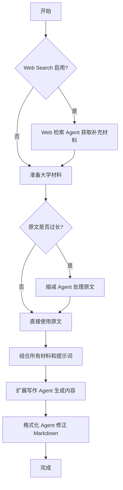
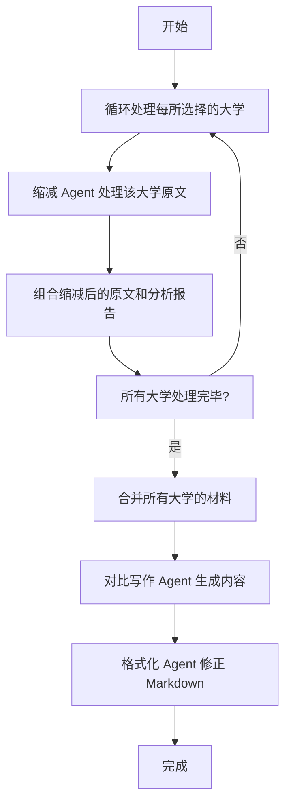
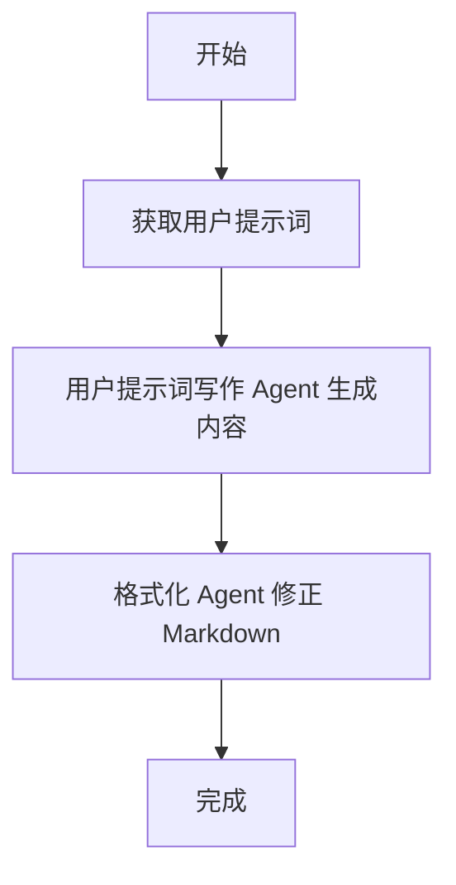

# 博客管理与 AI 生成

RunJPLib 提供了一套完整的博客管理功能，并集成了强大的 AI 辅助创作工具，帮助管理员高效地生成和管理内容。

## 博客管理

管理员可以通过后台的“Blog 一览”页面 (`/admin/manage/blogs`) 对所有博客文章进行管理。

- **查看与编辑**: 可以查看所有已发布的博客，并直接在线编辑任何一篇文章的标题和 Markdown 原文。
- **删除**: 可以删除不再需要的博客文章。
- **新建**: 点击“新建博客”按钮，即可进入 AI 博客生成器页面。

## AI 博客生成器

这是管理后台的核心内容创作工具，允许管理员通过 AI 辅助，以多种模式创建博客文章。

### 生成模式

1.  **材料扩展模式**:
    - **用途**: 基于一所或多所大学的招生简章原文，结合用户的具体要求进行扩展创作。
    - **Web Search 支持**: 在此模式下，系统可以额外启用网络检索功能，从日语的权威来源查找补充材料，丰富文章内容。

2.  **对比分析模式**:
    - **用途**: 用于生成多所大学的横向对比或综合推荐类文章。
    - **智能缩减**: 系统会先智能地缩减每所大学的原文材料，提取核心要点，然后再将这些要点交给 AI 进行对比和分析。

3.  **纯用户提示词模式**:
    - **用途**: 完全脱离现有的大学材料，仅根据管理员输入的提示词、草稿或主题进行创作和优化。

### 使用流程

1.  **选择大学 (可选)**: 在“材料扩展”或“对比分析”模式下，通过搜索选择一所或多所大学作为 AI 的参考材料。
2.  **填写用户提示词**: 输入具体的写作指令，例如“请对比这几所大学的学费和奖学金制度”。
3.  **修改系统提示词 (可选)**: 高级用户可以微调预设的系统提示词，以控制 AI 的行为（如语气、格式等）。
4.  **生成内容**: 点击“生成博客内容”按钮，AI 将根据所选模式和输入，生成文章的标题和 Markdown 内容。
5.  **编辑与保存**: 管理员可以在生成结果的基础上直接编辑，或完全手动撰写。只要标题和内容不为空，即可保存文章。

## 详细实现：Agent 协作流程

博客生成器 (`utils/blog_generator.py`) 的核心是多个专注不同任务的 AI Agent 的协作。以下是各模式下的具体实现：

### Agent 角色定义

- **Web 检索 Agent (`PROMPT_WEB_SEARCH`)**: 根据用户提示和大学名称，进行网络检索，寻找日语的权威补充材料。
- **招生简章缩减 Agent (`PROMPT_REDUCER`)**: 负责将长篇的招生简章原文（`original_md`）缩减为包含核心信息的摘要。
- **写作 Agent (`PROMPT_EXPAND`, `PROMPT_COMPARE`, `PROMPT_USER_ONLY`)**: 这是主要的写作 Agent，根据不同的系统提示词，完成最终的文章创作，并以 JSON 格式（包含 `title` 和 `content`）输出。
- **Markdown 格式化 Agent (`PROMPT_FORMATTER`)**: 对写作 Agent 生成的内容进行纯粹的格式化（如修正列表、代码块语法），不修改任何文字内容，确保输出格式规范。

### 工作流程

#### 1. 材料扩展模式 (expand)

#### 2. 对比分析模式 (compare)

#### 3. 纯用户提示词模式 (user_prompt_only)

## 自动 Wiki 功能

为了增强站内内容的关联性，博客系统集成了自动 Wiki 功能。

- **自动链接**: 在博客文章被保存或更新时，系统会自动识别内容中出现的大学名称（支持中文和日文），并为其添加指向本站对应大学信息页面的超链接。
- **智能处理**: 该功能会自动避免重复添加链接，并且对管理员完全透明，无需任何手动操作。
- **实现细节**: 使用数据库中的大学名称列表反向匹配博客文本，对匹配到的最长名称（以获得更精确的匹配）添加链接。

## API 端点

- `GET /admin/api/universities/search`: 根据查询参数 `q` 搜索大学。
- `POST /admin/api/blog/generate`: 接收大学ID列表、用户提示词和系统提示词，返回生成的博客内容。
- `POST /admin/api/blog/save`: 接收标题和Markdown内容，将其存入`blogs`集合。
